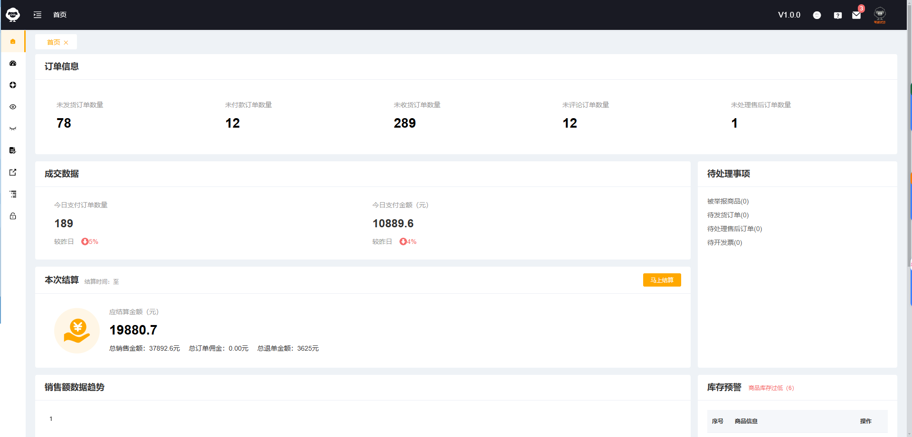
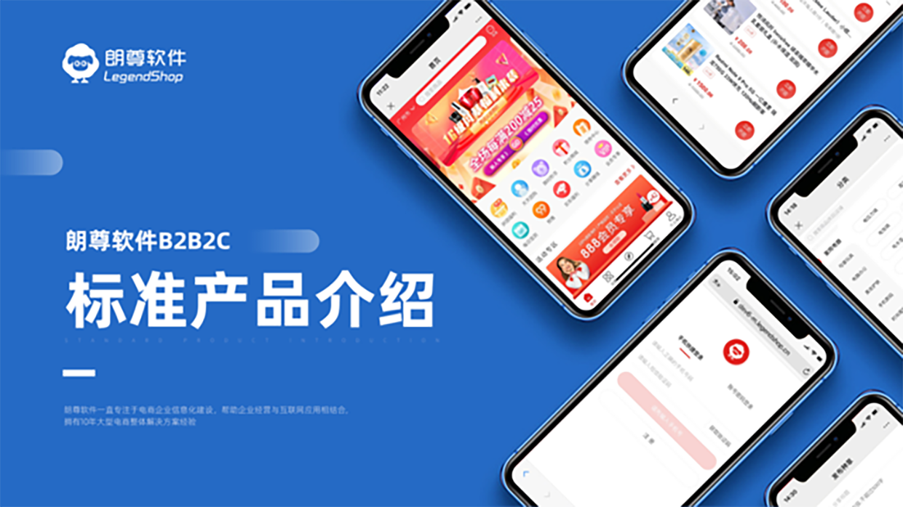
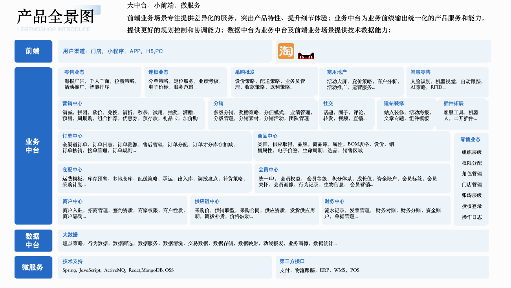
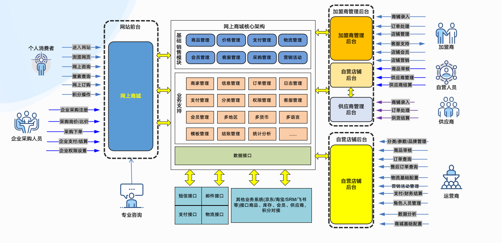
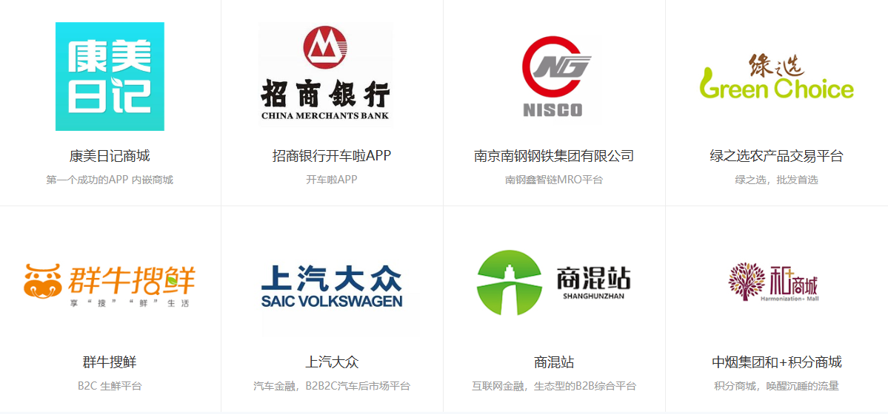

[comment]: <> (<p align="center"></p>)

[comment]: <> (![输入图片说明]&#40;./readme/legend-logo.jpg&#41;)
[// 冯]: # ()
[//]: # (![输入图片说明]&#40;https://dev6-images.legendshop.cn/miniprogram/static/images/readme/legend-logo.jpg&#41;)

[// 冯]: # ()
<h1 align="center">基于Spring Cloud Alibaba的企业级开源商城系统</h1>
<h4 align="center">全新升级 &nbsp; | &nbsp;  SpringBoot3.1.x  &nbsp; | &nbsp;  JDK17 &nbsp; | &nbsp; 全新Spring Cloud版本</h4>
<h4 align="center">基于 Spring Authorization Server 全新适配 OAuth 2.1 协议的企业级微服务架构</h4>

---

<p align="center">
    <a href="https://spring.io/projects/spring" target="_blank"></a>
    <a href="https://spring.io/projects/spring-boot" target="_blank"></a>
    <a href="https://spring.io/projects/spring-cloud" target="_blank"></a>
    <a href="https://github.com/spring-projects/spring-authorization-server" target="_blank"></a>
    <a href="https://github.com/alibaba/spring-cloud-alibaba" target="_blank"></a>
    <a href="https://nacos.io/zh-cn/index.html" target="_blank"></a>
</p>
<p align="center">
    <a href="https://bell-sw.com/pages/downloads/#downloads" target="_blank"></a>
    <a href="./LICENSE"></a>
    <a href="https://www.legendshop.cn"></a>
<a href='https://gitee.com/legendmall/legend-cloud/stargazers'></img></a>
<a href='https://gitee.com/legendmall/legend-cloud/members'></img></a>
    <a href="https://github.com/legendmall/legend-cloud"></a>)
    <a href="https://github.com/legendmall/legend-cloud"></a>
</p>
<p align="center">
    <a href="https://github.com/legendmall/legend-cloud">Github 仓库</a> &nbsp; | &nbsp;
    <a href="https://gitee.com/legendmall/legend-cloud">Gitee 仓库</a> &nbsp; | &nbsp;&nbsp;
    <a href="https://gitee.com/legendmall/legend-cloud/wikis/Home">wiki文档</a>
</p>

<h3 align="center"> 如果您觉得有帮助，请点右上角 "Star" 支持一下，万分感谢！</h3>
---
[// 冯]: # ()
<div id="fzq">
    <p style="padding: 0 1em;
      padding-top: 0px;
      padding-right: 1em;
      padding-bottom: 0px;
      padding-left: 1em;
      color: #6a737d;
      border-left: 0.25em solid #dfe2e7;">
        在现有条件允许的范围内，应当尽可能提升Web开发团队的工作效能，充分释放其技术潜力。
    </p>
    <p style="padding-top:10px">
        项目详细业务请移步至官网👇：
    </p>
    <a href="https://www.legendshop.cn/">https://www.legendshop.cn/</a>
</div>

[// 冯]: # ()
[// 冯]: # ()

## 🎯 我们主打三件事

<div align="center">

**① Legendshop 商城系统开源** &nbsp;·&nbsp; **② 带供应链 API 的商城系统** &nbsp;·&nbsp; **③ 带 AI 的开源商城**

</div>

| # | 主打 | 说明 |
|:--|------|------|
| ① | **Legendshop 商城系统开源** | B2B2C 多商户 / S2B2C 私域电商完整源码（后端 + 平台端 + 商家端 + 用户端），AGPL-3.0 协议开源，微服务 + 多租户架构，clone 下来就能跑 |
| ② | **带供应链 API 的商城系统** | 内置供应链开放平台，商品 / 库存 / 订单 / 结算全链路 Open API —— 商城不只是卖货前台，而是**能直接接进上游供应商体系**的采购履约入口，适配 MRO 工业品集采、央企国企内购、员工福利商城等场景 |
| ③ | **带 AI 的开源商城** | P2S2C 双层漏斗供需匹配推荐算法（已完成国家网信办算法备案）、AI 智能客服、智能选品与推荐（见 [legendshop-ai-mall](https://gitee.com/legendmall/legendshop-ai-mall)） |
| [legendshop-open-api](https://gitee.com/legendmall/legendshop-open-api) | 供应链开放平台 OpenAPI（87 个真实接口） + SDK | Java / Node |

> **一句话定位：Legendshop = 开源商城系统 + 供应链开放 API + AI 电商能力，三位一体。**
>
> 市面上开源商城不少，但大多是「只有前台卖货」的 Demo；**能同时把供应链 API 和 AI 能力开箱交付的，Legendshop 是少数派。**

[// 冯]: # ()

## 🎮 在线演示（无需部署，即刻体验 · 五端）

不用 clone、不用装环境，直接打开就能体验完整的企业级 B2B 供应链商城：

| 端 | 访问地址 | 体验账号 |
|----|---------|---------|
| 🏢 **平台管理端** | https://bbc7-admin.legendshop.cn | `test01` |
| 🏪 **商家端（PC）** | https://bbc7-shop.legendshop.cn | `18123456789` / `19123456789` |
| 🖥️ **用户端（PC）** | https://bbc7-pc.legendshop.cn | `19000000001` |
| 📱 **用户端（H5）** | https://bbc7-m.legendshop.cn | `19000000001` |
| 🔌 **供应链开放平台** | https://open.legendshop.cn | 需注册开放平台并创建应用（见 [legendshop-open-api](https://gitee.com/legendmall/legendshop-open-api)） |

> 商城四端体验密码统一为 `Aa123456`；开放平台账号为 `（账号需自行注册申请）`。
> ⚠️ 演示环境为示例数据、不承载真实交易，**请勿录入真实业务或支付信息**，演示数据可能不定期重置。


## 📃商城系统介绍

我们具有丰富多元的商业模式可以解决您任何使用场景的需求，服务的范围有s2b2c供应链商城、b2b2c多商户商城、社区拼团、社区团购、b2c单商户商城、b2b批发商城等等，众多商业模式中并含有限时秒杀、优惠券、满减、砍价、多级分销、套餐、拼团、消费返利、平台抽佣、储值、同城配送、到店自提、库存、代销、还有个性化diy装修服务， 自带供应链，客服体系，高效管理，轻松运营
 
## 🎯 为什么选择 Legend Cloud（差异化定位）

Legend Cloud 定位为「**企业级 B2B 供应链商城**」开源底座。与通用 B2C 零售模板最大的区别在于，它以 **产业互联与组织内购** 为核心场景：

- 🏭 **S2B2C 供应链商城**：自带供应链选品与多级分销，适合品牌私域与产业带招商；
- 🏢 **B2B2C 多商户商城**：支持平台招商、多商户入驻与平台抽佣；
- 🏛️ **央企 / 国企内购**：支持组织内部福利商城、员工内购与积分兑换体系；
- 🔧 **MRO 工业品采购**：面向制造业的 B2B 采购与供应商协同管理；
- 🤖 **员工福利商城 + AI 客服**：内置 AI 推荐与智能客服能力，降低运营门槛。

如果你需要的是「能直接用于企业采购 / 内部商城 / 供应链协同」的系统，而非单纯 C 端零售模板，Legend Cloud 更贴合。

## 📞关键内容
【企业级开源商城系统，助力电商业务高效启航！】 <br>
✔️ 基于主流技术框架开发，代码规范/注释清晰/架构严谨<br>
✔️ 支持S2B2C、B2B2C、B2C、O2O多模式自由组合<br>
✔️ 商业版源码即购即用，提供完整技术文档与接口说明<br>
✔️ 专业团队支持系统演示、定制二开与深度合作<br>
扫码添加技术顾问微信（备注"商城合作"，"购买源码"，"系统演示/试用"  等等）<br>


 <br>

获取：① 系统Demo体验 ② 商业授权方案 ③ 项目合作通道<br>

## 📞技术交流群


[// 冯]: # ()

## 本地账号（安全提示）
> ⚠️ 演示与本地环境的默认初始账号仅用于快速体验，请务必在首次部署后修改初始密码；生产环境请使用强密码并开启二次验证。默认体验账号可通过下方扫码获取，具体部署与初始化说明见 wiki 文档。

- 以下为微信H5端、小程序、公众号（扫码获取平台端、商家端体验账号）

## 演示地址
## 🔗演示地址
-   商城后台管理：https://mall-admin.legendshop.cn/
- 商城商家端：https://mall-shop.legendshop.cn/
- 扫码公众号获取体验账号
- 
  
- 以下为微信小程序、H5端（扫码获取平台端、商家端体验账号）<br>
  
  

> 部分功能演示视图，正在添加中

- 用户端截图
  
  
  


- 平台端演示截图

  

- 商家端演示截图
  
  
  

[// 冯]: # ()
## 🏢企业级微服务架构电商系统

Legend Cloud 是一款企业级微服务架构电商系统，全面拥抱Spring全家桶，基于Spring 6.0.13 、Spring Boot 3.1.5、Spring Cloud 2022.0.4、Spring Authorization Server 1.1.3、Spring Cloud Alibaba 2022.0.0.0、Nacos 2.2.1 等主流技术栈开发的B2B2C电商系统，遵循SpringBoot 编程思想，高度模块化和可配置化。具备服务发现、配置、熔断、限流、降级、监控、多级缓存、分布式事务、等功能。

## 标准产品介绍




## 总体架构


## 功能版本介绍

<a href="https://code.legendshop.cn">详情见官方网站>>>>>>></a>

## 技术栈和版本说明

### Spring系列及核心框架/工具版本

| 组件                          | 版本              |
|-----------------------------|-----------------|
| Spring                      | 6.0.13           |
| Spring Boot                 | 3.1.5           |
| Spring Cloud                | 2022.0.4        |
| Spring Cloud Alibaba        | 2022.0.0.0      |
| Spring Security             | 6.1.4           |
| Spring Authorization Server | 1.1.3           |
| Nacos                       | 2.2.1           |
| Sentinel                    | 1.8.6           |
| Seata                       | 1.7.0           |
| Knife4j                     | 4.3.0           |
| Xxl-Job                     | 2.4.0          |
| Mysql                       | 8.0.17          |
| Elasticsearch               | 8.8.1           |


> Spring Cloud Alibaba 版本对应关系，详见官方：[版本依赖说明](https://github.com/alibaba/spring-cloud-alibaba/wiki/%E7%89%88%E6%9C%AC%E8%AF%B4%E6%98%8E)

### 系统所涉及相关技术

- 持久层框架： Jpa-Plus(Spring Data Jpa & Mybatis Plus,自主研发，聚合两大持久层框架优点并升级，简单易用，可持续优化)
- API 网关：Spring Cloud Gateway
- 服务注册&发现和配置中心: Alibaba Nacos
- 服务消费：Spring Cloud OpenFeign
- 负载均衡：Spring Cloud Loadbalancer
- 服务熔断&降级&限流：Alibaba Sentinel
- 服务监控：Spring Boot Admin
- 消息队列：默认 RabbitMQ
- 分布式事务：Seata
- 数据缓存：JetCache (Redis + Caffeine) 多级缓存
- 数据库： Postgresql，MySQL，Oracle ...
- JSON 序列化：Jackson & FastJson
- 文件服务：阿里云 OSS / Minio
- 日志中心：ELK
- 日志收集：Logback


## 启动文档
- <a href="https://gitee.com/legendmall/legend-cloud/wikis/pages2/preview?sort_id=9258245&doc_id=4914160"> 快速启动（后端项目） </a>


## 版本号说明
\(^o^)/~本系统版本号，分为三段
- 第一段，表示重大架构调整本项目开源前已经从1.0迭代到现在7.0版本
- 第二段，表示系统功能的变更（增加）
- 第三段，表示系统功能维护及优化情况

## 工程结构

```
legend-cloud
├── business -- 主要业务服务工程
├    ├── legendshop-auth -- 登录认证服务
├    ├── legendshop-basic -- 系统基础服务
├    ├── legendshop-gateway -- Gateway路由模块
├    ├── legendshop-id -- 分布式ID生成服务
├    ├── legendshop-order -- 订单服务
├    ├── legendshop-product -- 商品服务
├    ├── legendshop-task -- 定时器任务
├    └── legendshop-user  -- 用户服务
├── common -- 系统公共包
├    ├── legendshop-common-core -- 系统基础核心模块
├    ├── legendshop-common-data -- Redis公共集成
├    ├── legendshop-common-datasource -- 数据源公共集成
├    ├── legendshop-common-excel -- Excel导入导出
├    ├── legendshop-common-feign -- Feign Client公共集成
├    ├── legendshop-common-id -- 公共Id服务相关
├    ├── legendshop-common-job -- xxl-job公共集成
├    ├── legendshop-common-log -- 公共日志模块
├    ├── legendshop-common-logistics -- 物流查询集成
├    ├── legendshop-common-monitor -- 服务监控
├    ├── legendshop-common-prometheus -- prometheus集成
├    ├── legendshop-common-rabbitmq -- rabbitmq集成
├    ├── legendshop-common-region -- 地区相关
├    ├── legendshop-common-sentinel -- 熔断降级
├    ├── legendshop-common-service -- 公共接口抽象
├    ├── legendshop-common-sms -- 短信集成
├    ├── legendshop-common-spider -- 爬虫相关
├    ├── legendshop-common-swagger -- 接口文档
├    ├── legendshop-common-validator -- 公共校验
├    ├── legendshop-common-wechat -- 微信相关公共集成
├    ├── legendshop-common-xss -- xss防范
├    └── legendshop-id-core -- 分布式ID生成核心类
├── common-private -- 系统公共包
├    ├── legendshop-common-captcha -- 滑块验证码模块
├    ├── legendshop-common-gateway -- Gateway公共类
├    ├── legendshop-common-oss -- 文件存储模块
├    ├── legendshop-common-security -- Spring Security
└──  └── legendshop-common-util --  公工具类
```

## 相关项目地址

- B2C单体版地址(暂未开源,敬请期待)：[https://gitee.com/legendmall/legend](https://gitee.com/legendmall/legend)
- 前端-平台端工程Gitee地址：[https://gitee.com/legendmall/legend-cloud-admin-ui](https://gitee.com/legendmall/legend-cloud-admin-ui)
- 前端-商家端工程Gitee地址：[https://gitee.com/legendmall/legend-cloud-shop-ui](https://gitee.com/legendmall/legend-cloud-shop-ui)
- 前端-用户端工程Gitee地址：[https://gitee.com/legendmall/legend-cloud-user-ui](https://gitee.com/legendmall/legend-cloud-user-ui)
- 前端-平台端工程Github地址：[https://gitee.com/legendmall/legend-cloud-admin-ui](https://github.com/legendmall/legend-cloud-admin-ui)
- 前端-商家端工程Github地址：[https://gitee.com/legendmall/legend-cloud-shop-ui](https://github.com/legendmall/legend-cloud-shop-ui)
- 前端-用户端工程Github地址：[https://gitee.com/legendmall/legend-cloud-user-ui](https://github.com/legendmall/legend-cloud-user-ui)

## 🧩 Legend Cloud 生态矩阵

Legend Cloud 由后端主仓与多个前端仓、衍生仓组成，建议按需 Star 你正在使用的仓库：

| 仓库 | 定位 | 技术栈 |
|------|------|--------|
| [legend-cloud](https://gitee.com/legendmall/legend-cloud) | 企业级微服务商城（后端主仓） | Java / Spring Cloud Alibaba |
| [legend-cloud-admin-ui](https://gitee.com/legendmall/legend-cloud-admin-ui) | 平台管理端 UI | Vue / Element |
| [legend-cloud-shop-ui](https://gitee.com/legendmall/legend-cloud-shop-ui) | 商家端 UI | Vue / Element |
| [legend-cloud-user-ui](https://gitee.com/legendmall/legend-cloud-user-ui) | 用户端 UI（Uni-App） | Vue / Uni-App |
| [legendshop](https://gitee.com/legendmall/legendshop) | Legendshop 商城（福利 / 积分 / 分销） | Java |
| [legendshop-ai-mall](https://gitee.com/legendmall/legendshop-ai-mall) | Legendshop AI 商城（AI 电商赛道） | Java |

> 想完整体验，请优先 Star 后端主仓 legend-cloud，再按需 Star 对应前端仓。欢迎在对应仓库提 Issue / PR。

## 技术解析
> 后续阶段性推出一些企业级验证的技术解析文章，敬请期待

## 授权协议

> 本项目基于 AGPL-3.0 开源协议，商业项目请联系授权，并遵守以下补充条款

- 不得将本软件应用于危害国家安全、荣誉和利益的行为，不能以任何形式用于非法为目的的行为。
- 在延伸的代码中（修改现有源代码衍生的代码中）需要带有原来代码中的协议、版权声明和其他原作者 规定需要包含的说明（请尊重原作者的著作权，不要删除或修改文件中的Copyright和@author信息） 更不要，全局替换源代码中的 Legendshop Cloud等字样，否则你将违反本协议条款承担责任。
- 您若套用本软件的一些代码或功能参考，请保留源文件中的版权和作者，需要在您的软件介绍明显位置 说明出处，举例：本软件基于 Legend Cloud 微服务架构，并附带链接：https://www.legendshop.cn
- 任何基于本软件而产生的一切法律纠纷和责任，均于作者无关。
- 如果你对本软件有改进，希望可以贡献给我们，双向奔赴互相成就才是王道。
- 本项目已申请软件著作权，请尊重开源。

## 参与贡献

1. 在 Gitee fork 项目到自己的 repo
2. 把 fork 过去的项目也就是你的项目 clone 到你的本地
3. 修改代码（记得一定要修改 develop 分支）
4. commit 代码，push 到自己的库（develop 分支）
5. 登录 Gitee 在你首页可以看到一个 pull request 按钮，点击它，填写一些说明信息，然后提交即可。
6. 等待维护者合并

计划升级到spring cloud 2023

## 与行业标杆企业协同进化，提速发展进程


## 交流反馈

- Legend Cloud 官网 https://code.legendshop.cn
- Legend Cloud官方技术QQ 1群：96642931
- Legend Cloud官方技术QQ 2群：190339088
- 如需购买商业高级版源码，请联系商务微信 18028664618


## 🏆 标杆客户与落地实践

Legend Cloud 已服务于多家央企、国企及制造业、金融、烟草行业龙头企业，典型落地场景包括：

- 🏛️ **南京钢铁**：大型钢铁集团数字化采购与商城体系；
- 🚬 **湖南中烟**：员工积分 / 福利商城，活跃用户规模行业领先；
- 🏦 **招商银行**：金融场景电商能力集成；
- 🚗 **上汽大众**：汽车产业上下游电商协同。

> 更多行业案例与落地数据，请见官网案例中心：https://www.legendshop.cn/
>
> 以上客户名称仅用于说明产品适用行业，具体项目指标以官方公开资料为准。

## 特别鸣谢\(^o^)/~\(^o^)/~\(^o^)/~
- [广州朗尊软件科技有限公司](https://www.legendshop.cn)
