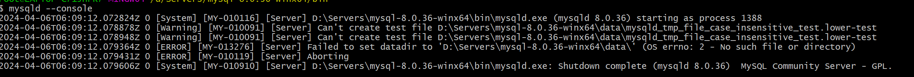
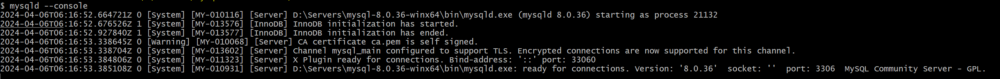
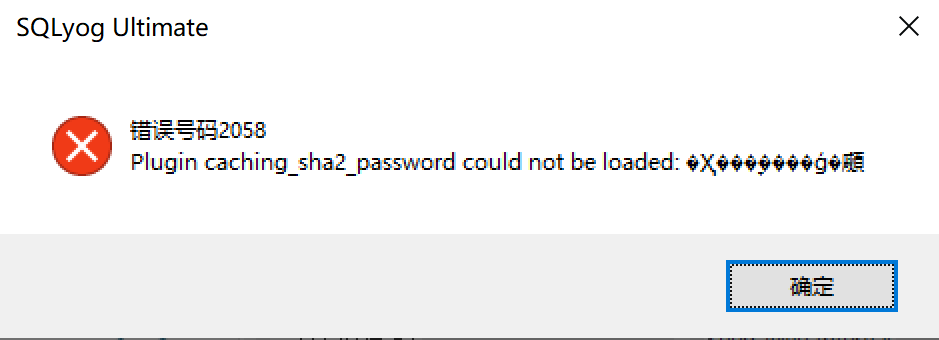
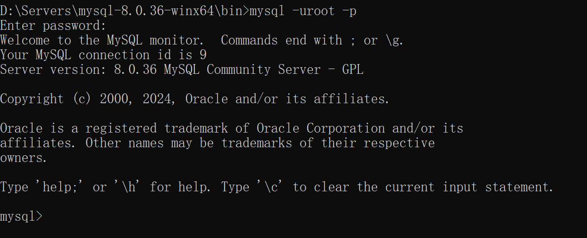
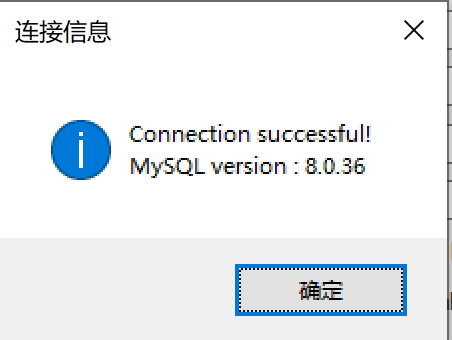

#### 启动mysql

下载完mysql8的zip包之后，执行命令
`mysqld --console`

#### 错误一：
MySQL无法启动

#### 解决方案：
1. 如已经存在data文件夹，则手动删除创建的data文件.
2. 在bin目录下执行以下命令，重新创建data文件夹及对应的文件.

    `mysqld --initialize-insecure`

启动MySQL

#### 错误二：
MySQL启动之后无法连接

#### 解决方案：
1. 需要设置MySQL root账号的默认密码
在MySQL的bin目录下，采用CMD命令进入MySQL的控制台,
   ``mysql -uroot -p`` 并输入密码，刚开始密码为空，直接按回车键即可。

执行以下命令，注意123456要改为自有密码
``ALTER USER 'root'@'localhost' IDENTIFIED WITH 'mysql_native_password' BY '123456';``

再次连接便可以成功连接上MySQL

跟着可以把应用的SQL脚本导入到MySQL中......

